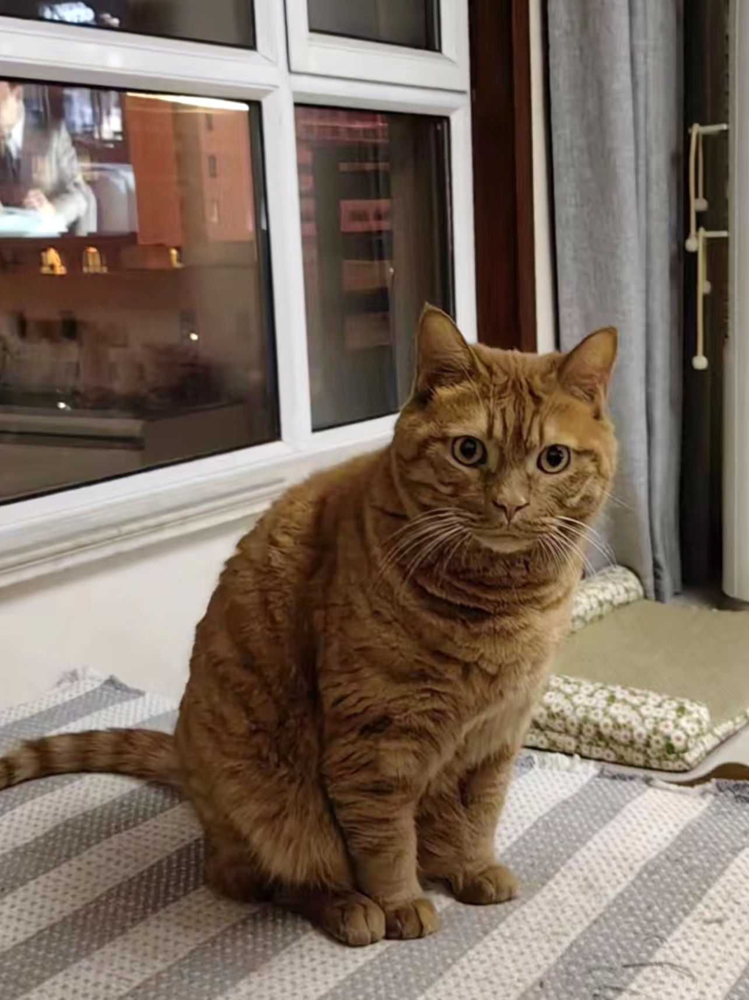

 

## Welcome to Claire's Personal Website 

  **Self Introduction**:
 Hi, I am Jiying Wang, a first year master student in Biostatistics, with a track of statistical genetics.
 Here are the links to the [Experiences](experiences.html), [Projects](projects.html), and [Plotly](plotly.html) page. You can see my academic background, working experience, as well as some plots I made there.

## Fun Facts about Me
  **Cat Person**:
  Let me introduce you my cat. His name is Simba because he's such a BIG cat, just like a lion (or tiger).

 **Love Traveling**
  I have a great passion of traveling. Here are some pictures of Alaska, San Francisco, and Kyoto. 

